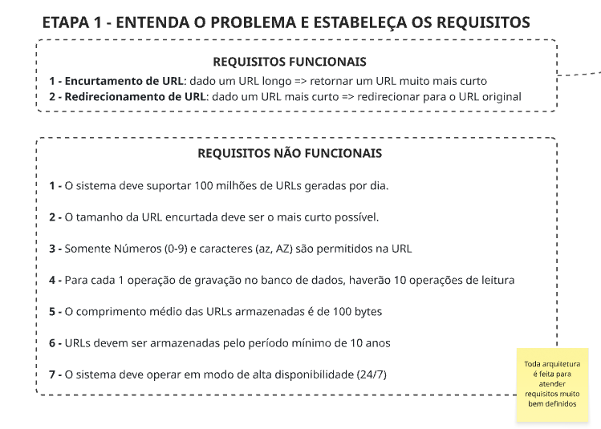

# UrlShortener

Um projeto para estudo de system design, aplicado a uma aplicação de encurtamento de URLs.  
Esse estudo tem como base o [vídeo](https://www.youtube.com/watch?v=m_anIoKW7Jg) do Renato Augusto no YouTube sobre o assunto.  

## Requisitos

## Estimativas

